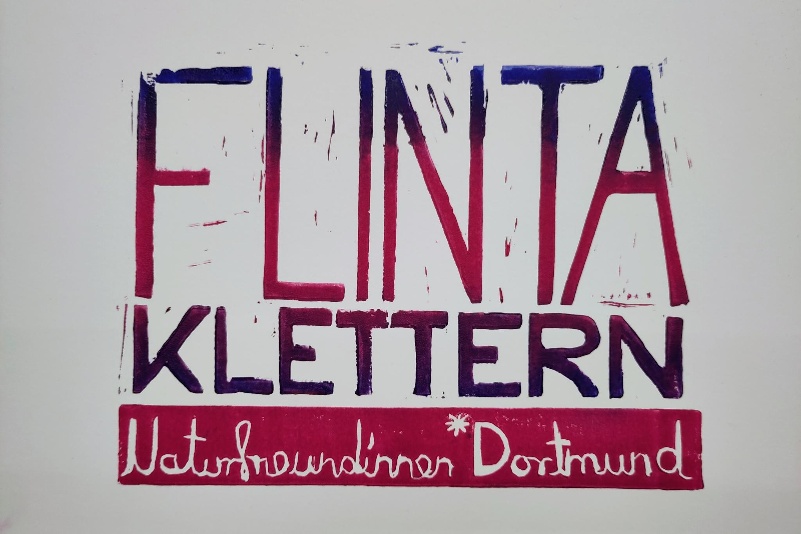

## FLINTA* only

### FLINTA* Klettern Naturfreund:innen Dortmund

Der Begriff FLINTA* steht für Frauen, Lesben, inter, nicht-binäre, trans und agender Personen – also Personen, die aufgrund ihrer geschlechtlichen und/oder sexuellen Identität patriarchal diskriminiert werden.

Anfang des Jahres 2025 entstand in einem kleinen Kreis der Klettergruppe, die Idee, einen geschützten Raum für FLINTA* Personen der Naturfreund:innen Dortmund zu
schaffen. Im Februar 2025 haben wir die Gruppe gestartet. Wir treffen uns seit dem jeden ersten Montag im Monat von 17h bis 20h in der Kletterhalle Nord I an der Münsterstraße. In diesem Rahmen konnten wir einigen Menschen das Tope Rope sichern zeigen, uns über Klettermaterial austauschen und Tipps, wenn nötig, beim ausbouldern der Routen gegeben - ohne Grenzen anderer zu überschreiten!

Für das Jahr 2026 planen wir Ausflüge zum Fels und ein FLINTA* Wochenende am Ith.

Kommt gerne vorbei, vernetzt euch und bringt eure friends mit!

Berg frei!
Zülfi und Andi