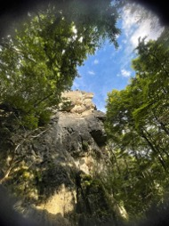
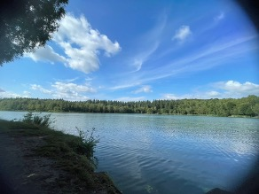
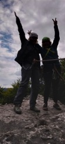
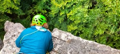
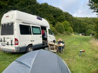

## FLINTA-Kletterwochenende Ith

Nach einigen ersten FLINTA-Treffen in der Halle Nord kam die Idee auf im Spätsommer ein gemeinsames Wochenende an die Felsen des Ith des Weserberglands zu fahren. Das Wetter sollte durchwachsen sein, weshalb die Teilnehmerzahl auf zwei schrumpfte. 

Vor uns lagen zweieinhalb Tage Felsklettern. Voller Vorfreude düsten wir Freitag Mittag los uns steuerten direkt den Fals an. Der Wettergott meinte es gut mit uns und bescherte uns einen traumhaften Spätsommerabend an der Parkplatzwand, wo wir uns bereits die Finger langemachten und gut einkletterten. Den Sonnenuntergang genossen wir mit einem Bad im See und beendeten den Tag mit leckerem Essen.

Den Samstag verbrachten wir an schroffen Felsen, genossen die abwechslungsreichen Routen und die weite Aussicht über das Weserbergland. 

Zwischen anspruchsvollen Zügen und entspannten Pausen im Wald blieb genug Zeit für gute Gespräche und gemeinsames Lachen. Auch das Gipfelerlebnis blieb nicht aus.

In entspannter Atmosphäre erprobten wir das Legen mobiler Sicherungen und wagten uns in Routen ohne fixe Sicherungspunkte. Abends ließen wir den Tag mit leckerem Essen auf dem Campingplatz mit dem Gefühl ausklingen, genau am richtigen Ort gewesen zu sein. 

Nach einem ausgiebigen Frühstück packten wir noch schnell zusammen und machten uns erneut auf an den Fels, wo wir weiter unsere Fähigkeiten des Legens mobiler Sicherungen ausbauten und unsere Ängste überwanden. Nach leckerer Brotzeit im Wald machten wir uns auf den Heimweg. Nina
