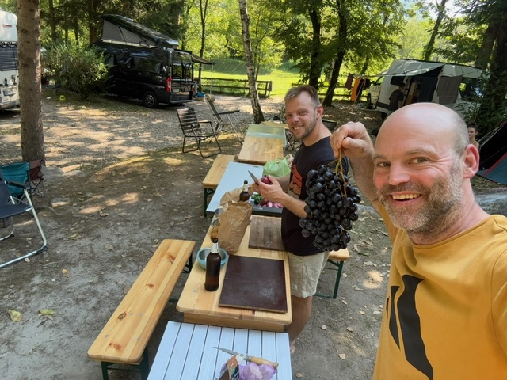
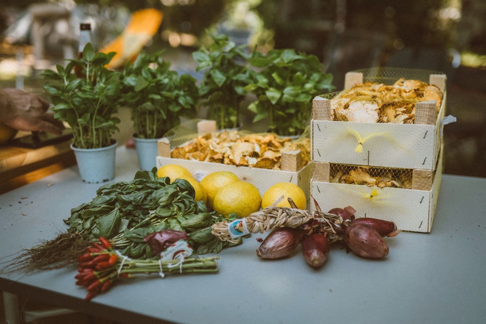
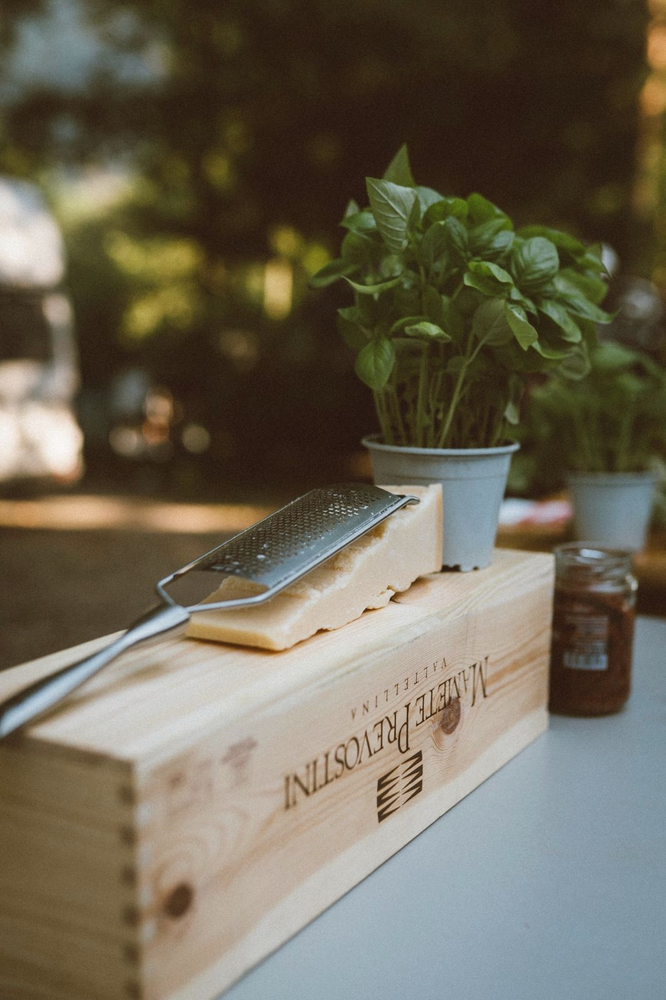
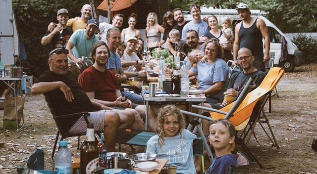

## Naturfreunde Trattoria auf dem Camping Acquafraggia im südlichen Bergell

<!-- Johanna, ich habe einfach ein paar Bilder ausgewählt. Die sind alle so toll, dass ich mich nicht entscheiden konnte. Schau mal bitte ob und wie Du vielleicht ein Collage über eine ganze Seite mit einbauen kannst.  -->
Chiavenna lag an diesem Morgen still zwischen den Bergen, als unsere bunte gemischte Klettergruppe von ca. dreißig Kletterbegeisterten auf dem Campingplatz erwachte. Zwischen Zelten, Campern und Wohnwagen krochen nach und nach alle aus ihren Schlafsäcken, suchten nach Kletterschuhen, Sonnencreme oder Kaffee – je nachdem, was zuerst nötig war. Wir mittendrin, Teil der großen Gruppe, aber heute mit einer besonderen Aufgabe: Fürs Kochen waren wir heute komplett am Start. Etwas übermotiviert hatte unsere Kochgruppe beschlossen, das komplette Camp gegen Materialkosten zur Naturfreunde Camping Trattoria einzuladen und wir uns zum Grossküchenteam.

Am Vormittag, noch bevor die heiße Sonne die Felsen richtig erwärmte, machten wir uns auf in die kleine Altstadt. Auf dem Markt deckten wir uns mit allem ein, was wir für unser großes Abendessen brauchten: frische Burrata, süße Weintrauben, duftende Fenchelsamen, Pfifferlinge, Ruccola, Parmesan – und natürlich ein paar kleine Extras, die wir beim Schlendern einfach nicht liegen lassen konnten. Mit vollen Taschen und guter Laune – und einem ziemlich ambitionierten Großeinkauf – kehrten wir zurück zum Campingplatz und hier starteten wir, nach einer kleinen Döpsung, in der nächstgelegenen kühlen Gumpe, mit dem Vorbereitungen.

Wir fingen schon am frühen Nachmittag an zu kochen. Pablo und Torre reinigten gefühlt 2 Stunden drei Kilo Pfifferlinge, Horst legte jede Menge Kilos Weintrauben karamellisiert in Fenchelsud ein und Jan und Jonas schnibbelten dies und das und taten so als hätten Sie alles im Griff. Nach den groben Vorbereitungen stellten wir alle Campingtische zusammen und dekorierten sie mit frischem Basilikum, dicken Parmesanstücken, italienischen Servietten und guten Weinen - Naturfreunde Camping Trattoria halt.

Als der Abend näher rückte, lief unsere Schicht auf Hochtouren. Noch war es hell, als wir schnitten, rührten, probierten und lachten, während sich die Sonne langsam hinter den Granitwänden verlor. Gegen Abend, als alle hungrigen Kletter Mäuler wieder im Camp waren, öffneten wir unserer wunderbare Naturfreunde Camping Trattoria und alle liessen sich voller Vorfreude an unserer langen Tafel nieder.

---

### Menu della Trattoria

Nero d’Avola Sicilia DOC 2023 – Feudo Arancio
Pinot Grigio delle Venezie DOC – Zenato

#### Antipasto

Burrata fresca
Cremige Burrata, serviert mit süßen Weintrauben, Basilikum, Cherry-Essig und gerösteten Fenchelsamen – frisch, aromatisch und der perfekte Auftakt.

#### Primo Piatto

Pasta ai Finferli
Pasta in einer samtigen Pfifferlingsahnesoße, verfeinert mit frischem Rucola,,Zitronen und einer großzügigen Portion Parmesan.
Ein echtes Wohlfühlgericht nach einem Tag am Fels.

#### Dolci

Dolci misti italiani
Eine kleine, liebevoll angerichtete Auswahl:
ein Hauch Tiramisù,
ein bisschen Panna Cotta,
ein Löffel pures Italien.

Espresso und dazu Grappa Barricata 17 – Distillerie Franciacorta Warm, weich und perfekt, um den Abend langsam ausklingen zu lassen.

---

Anschließend  saßen wir gemeinsam mit allen anderen unter der Lichterkette, müde vom Klettern, satt vom Essen und  glücklich über diesen gemeinsamen Abend und das unser Menü auch in den Naturfreunde Monstertöpfen so gut geworden ist. Jemand taufte uns beim Grappa augenzwinkernd „Team Gourmet“. Wir sahen uns an, grinsten – und ließen das einfach mal gelten.

Wir freuen uns auf das nächste Naturfreunde Menü mit euch. 

Team Gourmet