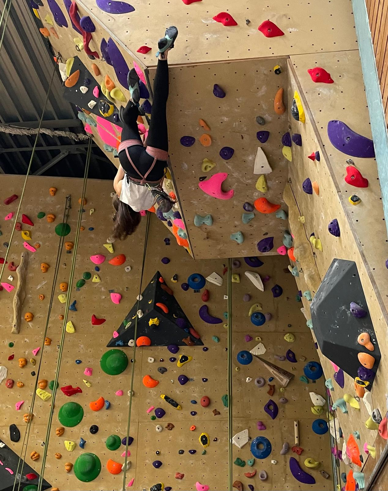
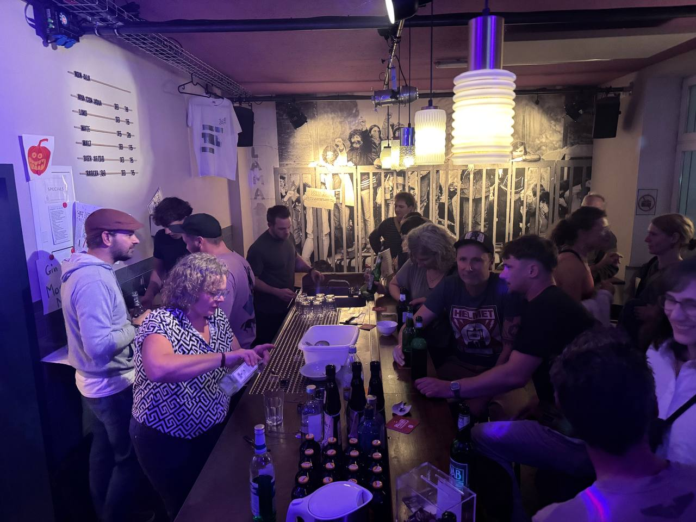

## Kletterparty 

In der Sporthalle Nord I fand am 08.11.25 die alljährliche Kletterparty der Naturfreund:innen Dortmund statt. Um optimale Bedingungen zu schaffen, wurden in den vier Wochen zuvor sämtliche Klettergriffe gewissenhaft abgeschraubt und gründlich gereinigt. Pünktlich zum Wettbewerb brachten engagierte Schrauber:innen und Helfer:innen die Griffe anschließend in neuer Anordnung wieder an der Wand an. Ein herzlicher Dank gilt allen Menschen, die an diesen umfangreichen Vorbereitungen beteiligt waren.

Am Veranstaltungstag traten die Teilnehmenden in den Kategorien Kinder, Jugendliche, Damen und Herren jeweils in drei Qualifikationsrouten gegeneinander an. Während bei den Kindern und Jugendlichen direkt im Anschluss die Finalroute folgte, mussten sich die Damen und Herren zunächst noch durch ein Halbfinale klettern, um die Finalteilnehmenden zu ermitteln. Während es bei den Kindern und Jugendlichen so schien, als würden sie den Tag spielerisch meistern, lagen bei den Erwachsenen die Nerven teilweise blank. Glücklicherweise stand der Vergleich nicht im Vordergrund – vielmehr prägten Solidarität und gegenseitige Unterstützung das Geschehen. Es wurde sich Mut zugesprochen, mitgefiebert und jeder Versuch gefeiert. Die Stimmung war ausgelassen und in allen Kategorien gab es eine große Zahl an Teilnehmenden, welche vom Publikum in ihren Bemühungen bejubelt wurden.

Verpflegt wurden alle Besucher:innen durch ein reichhaltiges Buffet mit Leckereien und Getränken, das durch die große Bereitschaft fürsorglicher Menschen ermöglicht wurde, die Speisen und Getränke mitbrachten und vorbereiteten.

Hervorzuheben ist auch die Kooperation mit zwei Schulen des Viertels. So nahmen Schüler:innen der Kletter-AG der Gertrud-Bäumer-Realschule teil und an der Schule am Hafen wurden unter fleißigen Händen die Trophäen gebaut, welche symbolisch die ersten drei Plätze jeder Kategorie schmückten. Nachdem die Halle nach dem Prinzip „Viele Hände, schnelles Ende“ wieder in ihren Ursprungszustand zurückversetzt worden war, wurde die Party in den Nordpol verlegt. Dort gab es Getränke und Live-Auftritte von Monstr Morski und dem Astro Groove Collective. Es konnte getanzt und ausgelassen gefeiert werden. Nach den Live-Auftritten untermalte DJ Mampfret das Treiben. Hier auch ein großes Dankeschön an alle Kunst- und Kulturschaffenden, an alle Beteiligten in Vorbereitung und Durchführung, an alle Gäste und jede einzelne Person.

Es war ein schöner Tag, den es nur durch solidarische Kooperation gab. Darum denkt immer daran: Schützt das solidarische Netzwerk – seid nett zueinander.

Abschließend bleibt zu sagen: Nach der Kletterparty ist vor der Kletterparty. Wie eingehend beschrieben, wurden die Wände der Halle Nord neu beschraubt und es sind schöne Routen an die Panels geschraubt worden. Kommt gerne zu unseren offenen Kletterzeiten montags um 18 Uhr und vergnügt euch an kniffligen Bewegungsrätseln und Muskelprüfungen. Hier ist für alle etwas dabei.

Herzlich
Die Naturfreund:innen
