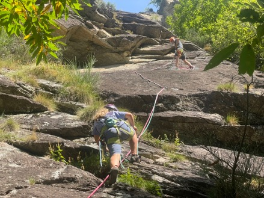
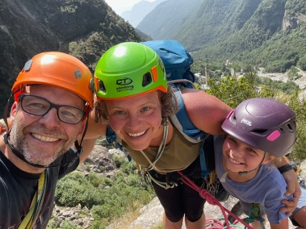
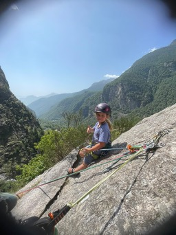
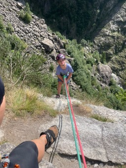

## Meine erste Mehrseillänge

Das war meine erste Mehrseillänge. Als Papa dann am ersten Stand war bin ich am blauen Seil los geklettert und Mama am pinken Seil. 



Als wir beide bei Papa waren, ist Papa im Vorstieg zum nächsten Stand geklettert. Dann sind Mama und ich wieder zu Papa geklettert. Das dann noch 1-2 Mal. 



Als wir alle 3 oben waren, haben wir Fotos gemacht und haben uns wieder abgeseilt. 




```
Von Hella (9 Jahre)
``` 