## Sommerfreizeit Ith für Kinder

Mit Beginn der Sommerferien in NRW war es endlich so weit. Am Morgen des 15. Juli ging es los zu unserer Sommer-/Klettefreizeit am Ith. Von Dortmund aus machten sich 31 Naturfreund\*innen der Ortsgruppen Dortmund Nord und Dortmund Kreuzviertel auf den Weg ins Weser-Bergland, um dort 10 Tage auf dem Campingplatz am Naturfreundehaus Lauenstein zu verbringen. Bis auf eine kleine Gruppe Erwachsener die sich schon einen Tag eher mit vollbeladenem PKW und Anhänger auf den Weg gemacht hatten um schon einmal das Camp aufzubauen, reisten die Teilnehmer\*innen gemeinsam mit dem Zug an. Von Dortmund aus ging es mit der Regionalbahn über Löhne nach Marinau. Nach einer kurzen Wanderung vom Bhf Marienau durch Felder und Wälder kamen wir am Naturfreunde Haus Lauenstein an.

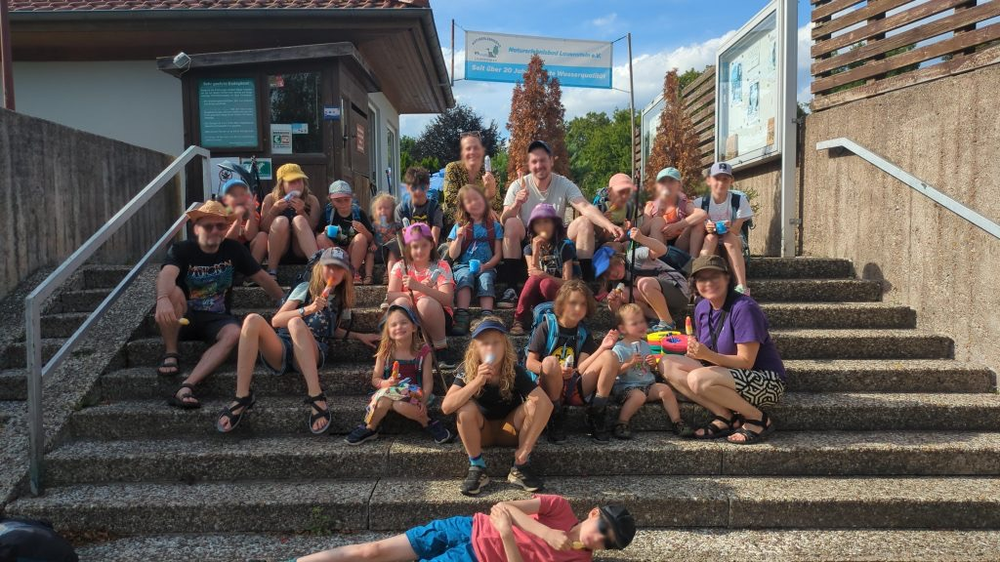
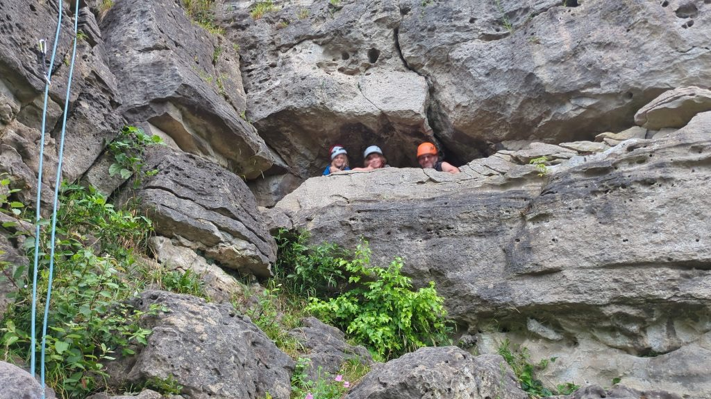
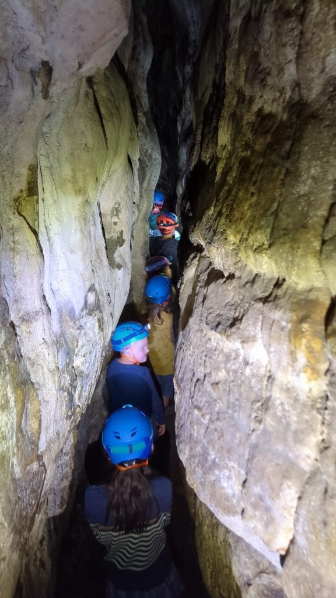
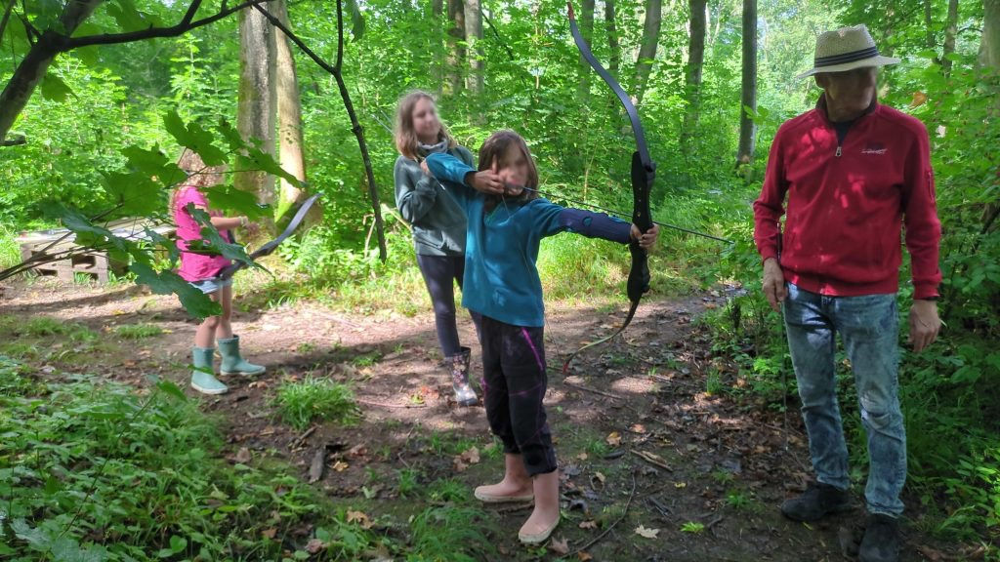

> Malik: Am meisten haben mir der Dreimeterturm im Naturschwimmbad und der Badesee gefallen

Nach dem alle die erste Nacht gut überstanden hatten, machten wir uns nach dem Frühstück auf den Weg um auf einer kleinen Wanderung die Umgebung zu erkunden. Auch vom Regen ließen wir uns nicht abhalten. Ausgestattet mit Regenjacken und Wanderschuhe ging es in den Wald bis zum Lauenteich. Der Nachmittag bei stärkerem Regen wurde mit gemeinsamen Vorlesen, Malen und Werwolf spielen verbracht.

> Eva: Mir hat besonders gut gefallen, dass wir so viel geklettert sind und vor allem am Fels.

Am Donnerstag ging es dann zum ersten mal an den Fels. Nach dem alle Kinder Essen u. Trinken, Regenkleidung und Klettersachen eingepackt hatten ging es zu den _Levedagsener Klippen_ in den Sektor mit den vielversprechenden Namen _Zirkus_. Nach einem kurzen Zustieg erreichten wir den wunderschönen Felsen.

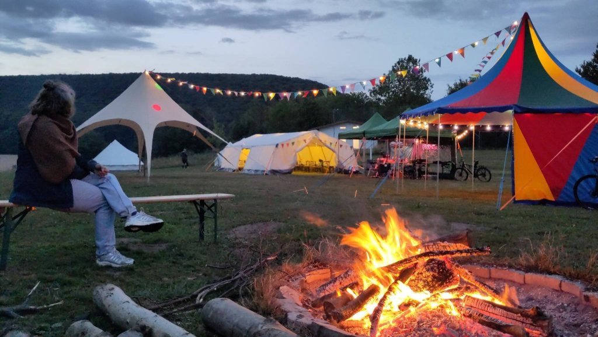
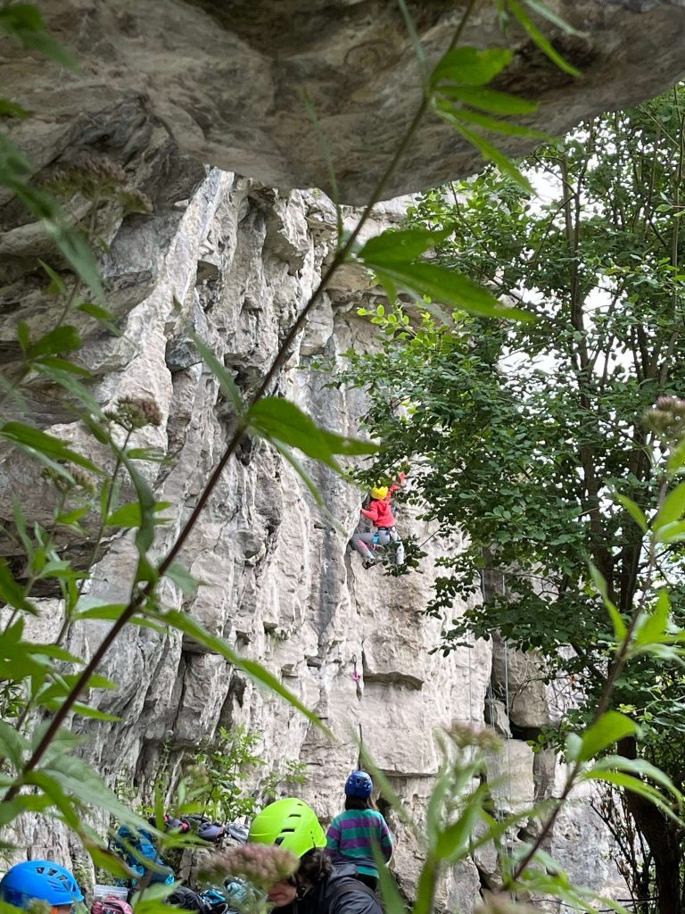
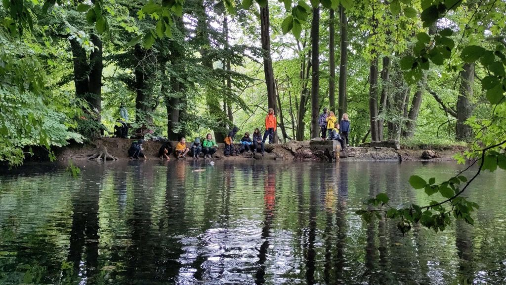
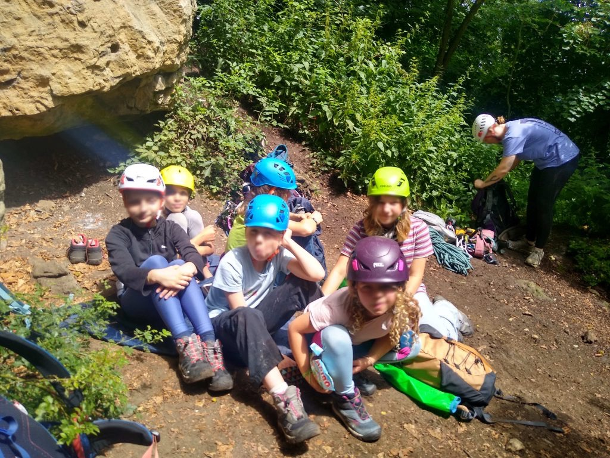

> Mila: das Programm, es war spannend und abwechslungsreich

Am Wochenende wurde das Wetter besser. Die grauen Wolken verzogen sich und mit der Sonne wurde es direkt heiß, sodass wir das gute Wetter nutzten um den Tag im nah gelegenen Naturfreibad zu verbringen. In den nächsten Tagen konnten die Kinder aus einem bunten Progamm wählen. So stand natürlich Klettern auf dem Programm, aber auch Bogenschießen, Schwimmen in einem nahegelegenen See und eine Höhlenexpedition. Wenn das Wetter mal nicht so gut war, gab es Angebote am Platz, wie ein Kreativprogramm mit Batiken, Armbänder fädeln und Buttons machen, einen Kino Abend oder Ringen und Raufen.

> Emilia: Dass wir bestimmt 15 mal Werwolf gespielt haben, was sehr lustig war.  Manchmal aber auch sehr wuselig und chaotisch

Einen Tag nutzte die Flinta-Klttergrupe um nur mit FLINTAs und Mädels an den Fels zu gehen. Es ging über die Felder am Naturfreundehaus und durch den Wald zum _Hohenstein_ an den _Marienauer Klippen_.

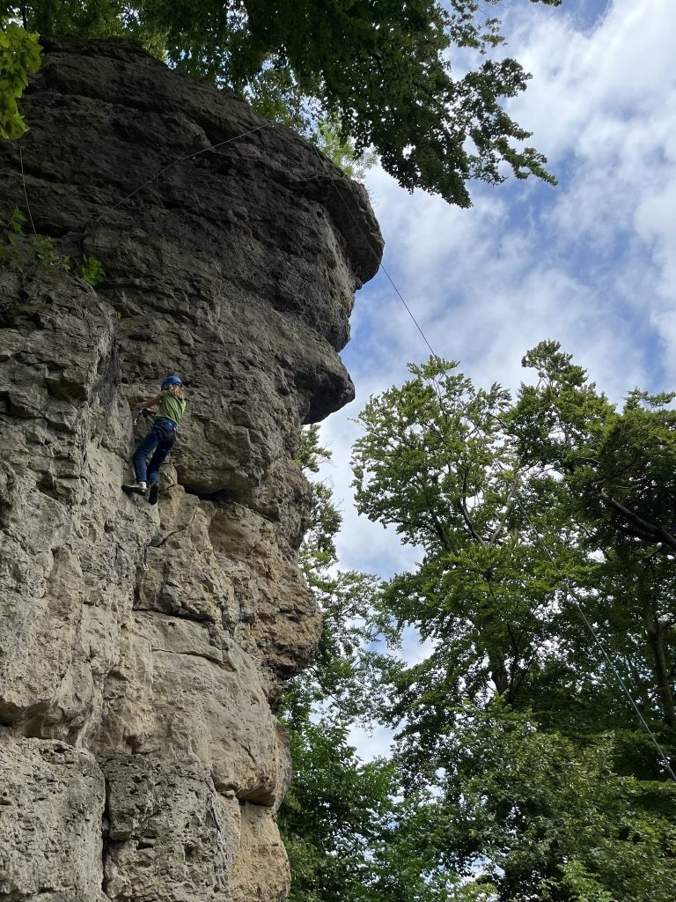
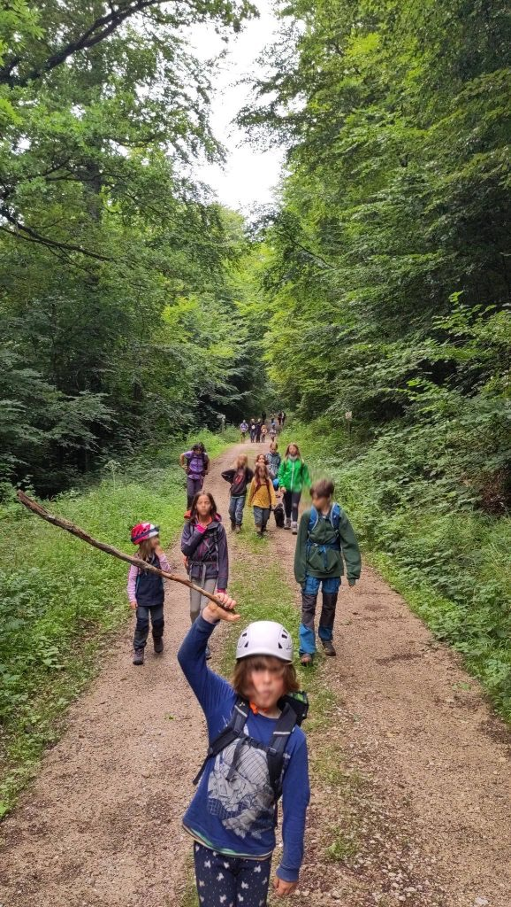
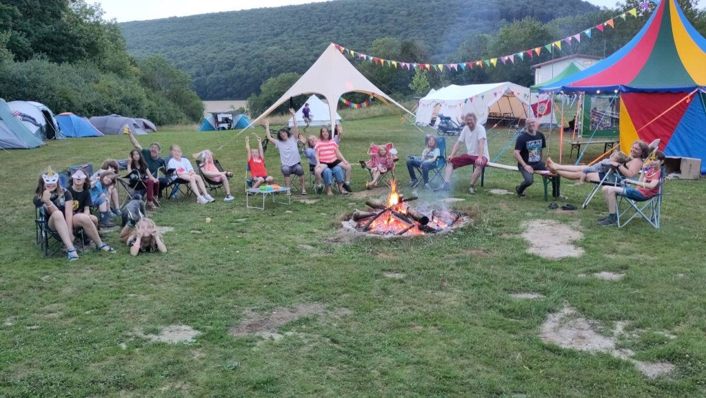
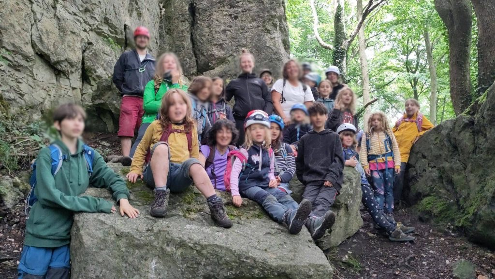

Den letzten Abend ließen wir mit Liedern und Gitarre am Lagerfeuer ausklingen.

> „Berg frei“ ist unser Gruß der hell erklingen muss, mit Apfelmus. Wo der Naturfreunde Wimpel weht,alles fest zusammen steht in Not und in Gefahr.“ 

Erschalte es auf dem Weg durch Felder auf dem Weg zum Bahnhof Marinau und bei der Ankunft im Dortmunder Hauptbahnhof. 

> Mila: „Ich dachte 10 Tage sind lang aber die Zeit ging schnell vorbei.“ – nächstes Jahr fahre ich wieder mit!

Ein großer Dank geht an das Naturfreundehaus Lauenstein und die Naturfreunde Lauenstein, die das Bogenschießen durchgeführt haben.

