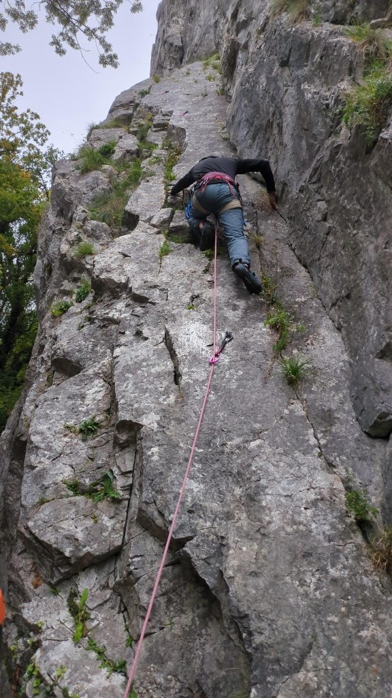
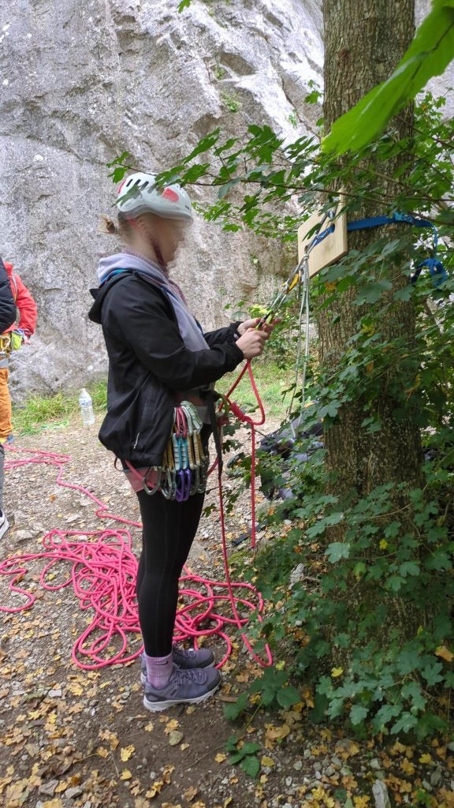
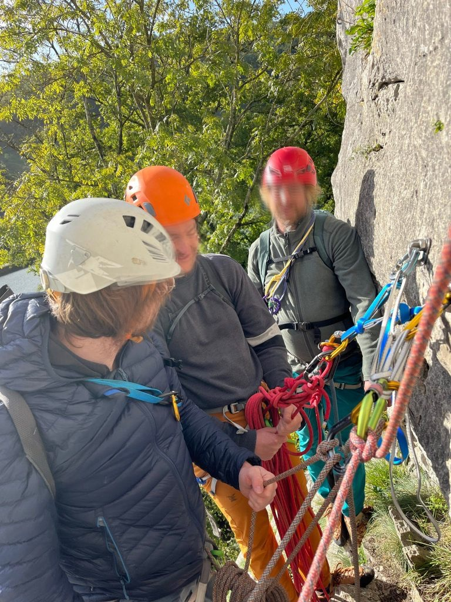
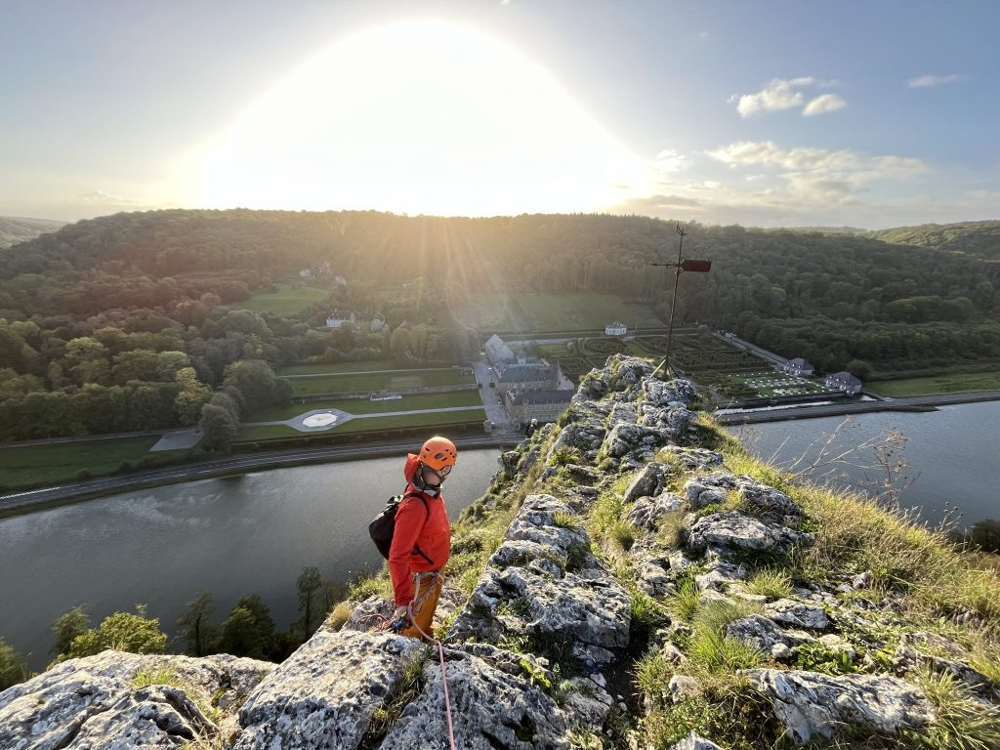
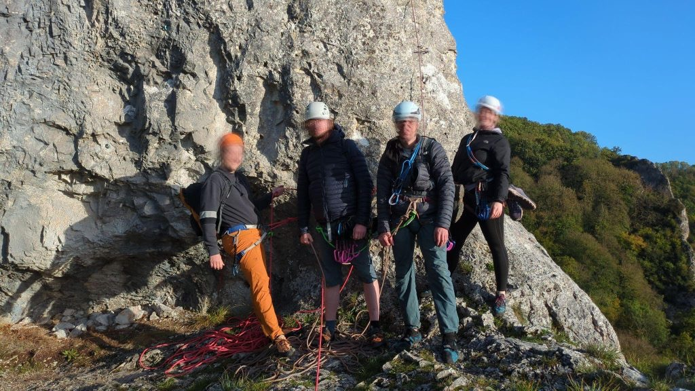
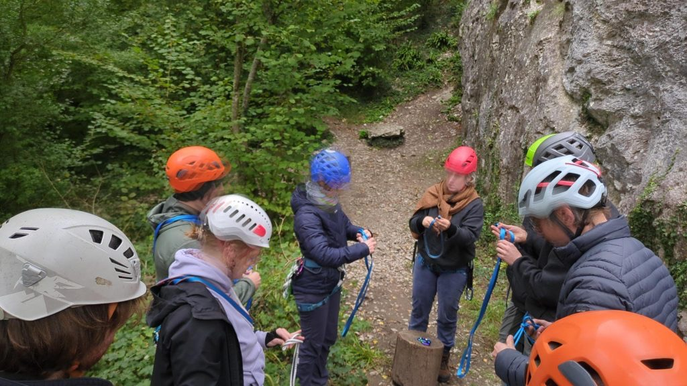
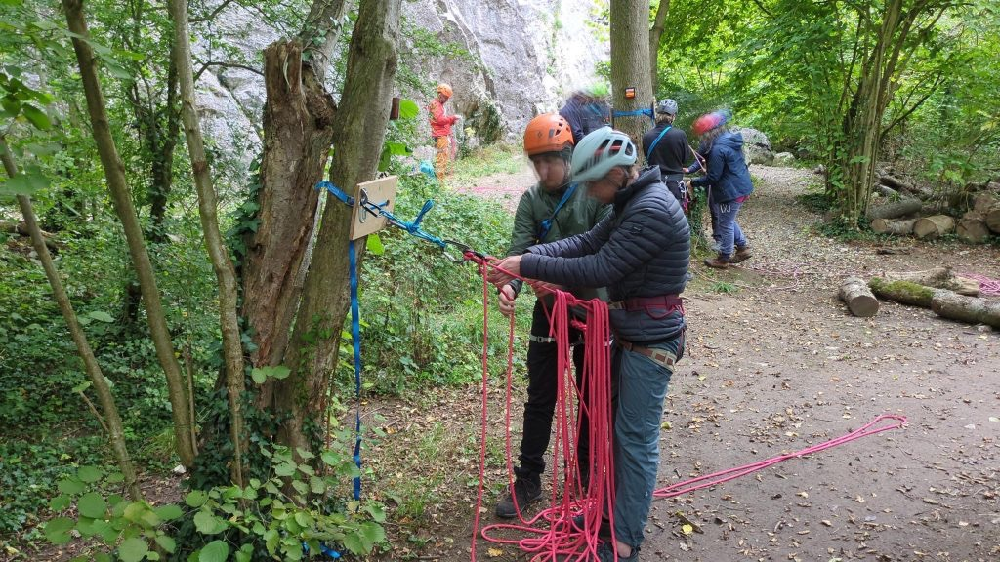

## Kletter-Workshop für Skillsharing, Auffrischung und Ausbildung an den Rochers de Freÿr (Belgien)

Am langen Oktoberwochenede startete der erste Ausbildungs- und Auffrischungs-Workshop der Landesfachgruppe Klettern der NaturFreunde NRW zu Themen wie Knotentechnik, Umbau am Top, Standplatzbau und Klettern in Mehrseillägenrouten. Mit zwei voll besetzten PKWs ging es am Donnerstag Abend von Dortmund aus los Richtung Belgien. Nach etwa 4 Stunden Fahrt durch den täglichen Feierabendstau auf Nordrhein-Westfälischen Autobahnen erreichten wir unsere Unterkunft für die nächsten drei Nächte im französischen Givet. 

Am nächsten morgen starteten wir, nach dem gemeinsamen Frühstück zu den ca 15km entfernten _Rochers de Freÿr_. An den Kalksteinfelsen am östlichen Ufer der Maas befindet sich Belgiens größtes Klettergebiet. Vom Parkplatz am Aussichtspunkt auf das Schloss Freyr ging es zunächst an der N95 entlang und dann steil bergab ans Ufer der Mass zum Fuße des Felsens _Le Merions_. Zunächst machten wir uns in ein paar Sportkletterrouten mit dem Felsen vertraut, bevor einige Teilnehmer\*innen nach einer Einführung und ausgiebigen Übungsphase zum Thema Standplatzbau, in ihre ersten Mehrseillängen-Routen einstiegen. Da wir mit zwei Seilschaften in der selben Route kletterten und an den Standplätzen jeweils aufeinander warteten, war sichergestellt das immer noch eine zweite Person am Standplatz zur Unterstützung anwesend war. So konnten diejenigen die ihre ersten Mehrseillängen kletterten ihre ersten Erfahrungen sammeln.

> „Ich habe an den drei Tagen sehr viele tolle neue Erfahrungen gemacht, viel gelernt und bin meine ersten Mehrseillängen geklettert. Ein wunderschönes Wochenende!“ (Frederick)

Das über Westeuropa herziehende Unwetter brachte auch uns am Samstag morgen Sturmböen und Regen, so das wir uns am Abend zuvor dazu entschieden unser Frühstück etwas nach hinten zu verschieben und erst später in unseren zweiten Kletter-Tag zu starten. Nachdem wir ausgeschlafen und ausgiebig gefrühstückt hatten, überlegten wir gemeinsam hin und her ob wir an den Felsen fahren oder als Alternative in eine Kletterhalle gehen sollten. Da der Regen nachließ und der Himmel aufriss entschieden wir uns trotz der im Tagesverlauf weiteren angekündigten Regenschauer wieder nach Freÿr zu fahren.

Als wir am Fels ankamen, zeigten sich einzelne blaue Flecken am Himmel. Bevor wir jedoch mit der Kletterei starteten, gab es von unseren Trainer:innen Ole und Zülfie eine Wiederholung des Themas Standplatzbau vom Vortag und eine Einführung zum Rückzug aus der Route. Auch das übten wir wieder an unseren an vier Bäumen befestigten Trainingsbrettern, dabei erwischte uns der für mittags angekündigte Regenschauer und wir wurden ordentlich durchnässt. 

Nach dem Regen trocknete der Fels erstaunlich schnell, so das wir uns mit fünf Seilschaften in zwei Routen auf den Weg machten. Als wir den Gipfel erreichten versank die Sonne bereits auf der gegenüberliegenden Flussseite hinter den Bäumen.

> „Der Workshop hat uns gut auf die anstehende Trainerausbildung im nächsten Jahr vorbereitet“ (Johanna)

Um den Sonntag noch gut nutzen zu können, standen wir an unserem dritten Workshop-Tag früh auf. Eine gute Entscheidung. Denn das schöne Wetter lockte einige weitere Kletterer\*innen an den Felsen. Dieses mal teilten wir die Gruppe. Mit einer Dreier und zwei Zweier Seilschaften gingen wir ebenfalls am Felsens _Le Merions_ in den Sektor _Cubitus_ in zwei Mehrseillängen-Routen. Am Gipfel angekommen gab es noch eine abschließende Lerneinheit zum Umbauen am Top. Eine zweite Gruppe übte das Umbauen am Top in Theorie und Praxis im Sektor _Les Lillois_. Bevor wir uns auf den Heimweg machten beendeten wir den Kletter Workshop mit einem gemeinsamen Pommes Essen.

Ein Riesen Dank geht an unsere Trainer\*innen Ole und Zülfi, der Landesfachgruppe Klettern der NaturFreunde NRW, die den Kletter-Workshop organisiert und geleitet haben. 